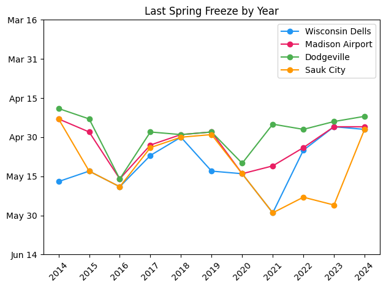
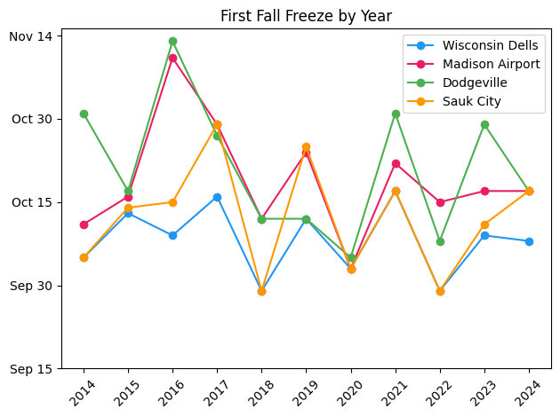
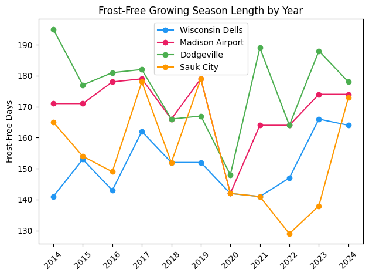

# Length of Growing Season in South-Central Wisconsin

James Dietmann

AAE 718

https://github.com/JamesDietmann/Climate_Data_Project_3

6/6/2026

## Introduction
From extreme weather events to rising sea levels, global climate change is real and has been affecting just about every aspect of the natural world. Many impacts of climate change harm ecosystems and the environment as a whole, but I am curious if there are any positive sides to the matter. One interesting question, especially in Wisconsin, is if climate change has been legthening the effective growing season. If so, farms may get better crop yields, which not only benefits the farmers but also provides more food for the rest of the population. This report attempts to answer the question of whether or not the frost-free growing season in south-central Wisconsin has lengthened over the past decade. 

## Methods
This report uses weather data from the National Oceanic and Atmospheric Administration to plot the last freeze in the spring and the first freeze in the fall to find the frost-free growing season. Located around my hometown of Prairie du Sac, WI, data from weather stations in Sauk City, Dodgeville, Madison, and the Wisconsin Dells was used in this project. The data was loaded into Python and prepared, before computing freeze dates and growing season lengths. Next, three figures were developed to show the last spring freeze, first fall freeze, and the frost-free growing season near each station from 2014 to 2025. 

## Results 

This line graph shows the last spring freeze by year for each weather station. The last spring freeze was fairly similar for all stations from 2014 to 2025. They differed slightly in 2014-2015 and 2021-2023 but only by a little over a month between stations. Generally, the Wisconsinn Dells and Sauk City weather stations, located further north, experienced a later last freeze than Dodgeville and Madison, further south. Among the same station, the last freeze dates didn't vary a ton between years. There is no consisetnt pattern showing that the last spring freeze has changed over the past decade.

This line graph shows the first fall freeze by year for each weather station. These values are far more inconsistent than the last spring freeze. Within the same year, the dates of first fall freeze from station to station vary substatially in many of the years. Among the same station, the first fall freeze changes quite a bit from year to year. A similar pattern to the last spring freeze is seen as the Wisconsin Dells and Sauk City stations tend to have an earlier first fall freeze than Dodgeville and Madison. Again, there is no consistent patern showing the first fall freeze date shifting from 2014 to 2025. 

This line graph shows the frost-free growing season near each weather staion from 2014 to 2025. Over the last decade, the frost-free growing season has had a large variance between both time and weather stations. Some years have around 50 day differences between the Dodgeville weather station and the Wisconsin Dells or Sauk City stations. The Sauk and Dodgville weather stations nearly have 40 day difference between consectutive years. None of the stations show a striong trend for an increasing frost-free-growing season over the last decade. The only trend that can be seen in the graph is The Wisconsin Dells and Sauk City stations haveing a shorter growing season than Dodgeville and Madison. 

## Discussion
Due to the lack of a visible trend in the graphs, this report fails to answer the question of whether or not the frost-free growing season in south-central Wisconsin has lengthened over the past decade. Several factors may have been at play that prevented a sound conclusion. 

First, the timeframe was likely not long enough. Weather events are natuarlly unpredicatable, and when the sample size is small like it was in this report, a cold day here and there can cause a trend to fall apart. A longer time period, such as 30 or 50 years, would have been preferable to smooth out the data and find a longer run trend. However it was difficult to find weather stations that fully covered the time period and geographical region I was focusing on. 

Another fault in the data may be the way I calculated the growing season. In the plant world, there is a difference between a frost and a hard frost. Depending on how cold it gets at night, a crop may survive a frost. Therefore, the effective growing season could be longer than the simple frost-free growing season. 